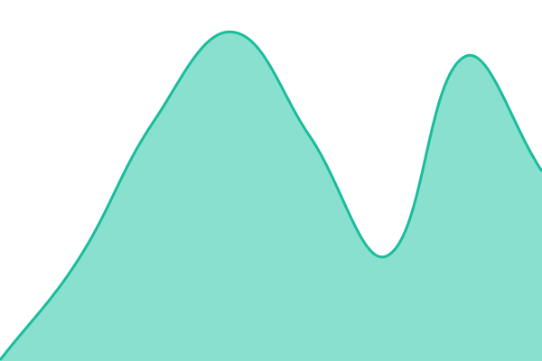

# [📈 Live Status](https://demo.upptime.js.org): <!--live status--> **🟩 All systems operational**

This repository contains the open-source uptime monitor and status page for [microshatter](https://demo.upptime.js.org), powered by [Upptime](https://github.com/upptime/upptime).

With [Upptime](https://upptime.js.org), you can get your own unlimited and free uptime monitor and status page, powered entirely by a GitHub repository. We use [Issues](https://github.com/microshatter/status/issues) as incident reports, [Actions](https://github.com/microshatter/status/actions) as uptime monitors, and [Pages](https://demo.upptime.js.org) for the status page.

<!--start: status pages-->
<!-- This summary is generated by Upptime (https://github.com/upptime/upptime) -->
<!-- Do not edit this manually, your changes will be overwritten -->
<!-- prettier-ignore -->
| URL | Status | History | Response Time | Uptime |
| --- | ------ | ------- | ------------- | ------ |
|  [FAN Studio](https://api.fanstudio.tech/) | 🟩 Up | [fan-studio.yml](https://github.com/microshatter/status/commits/HEAD/history/fan-studio.yml) | 

 1183ms
     
 | 

<a href="https://microshatter.github.io/status/history/fan-studio">100.00%</a>
    

|  [FAN Studio [Backup]](https://api.fanstudio.hk/) | 🟩 Up | [fan-studio-backup.yml](https://github.com/microshatter/status/commits/HEAD/history/fan-studio-backup.yml) | 

 1243ms
     
 | 

<a href="https://microshatter.github.io/status/history/fan-studio-backup">100.00%</a>
    

|  [WHEWS](https://api.2v8.cn) | 🟩 Up | [whews.yml](https://github.com/microshatter/status/commits/HEAD/history/whews.yml) | 

 2813ms
     
 | 

<a href="https://microshatter.github.io/status/history/whews">99.32%</a>
    

|  [WHEWS [Backup]](https://api.beecld.com/) | 🟩 Up | [whews-backup.yml](https://github.com/microshatter/status/commits/HEAD/history/whews-backup.yml) | 

 3736ms
     
 | 

<a href="https://microshatter.github.io/status/history/whews-backup">100.00%</a>
    

|  [Wolfx](https://wolfx.jp/) | 🟩 Up | [wolfx.yml](https://github.com/microshatter/status/commits/HEAD/history/wolfx.yml) | 

 249ms
     
 | 

<a href="https://microshatter.github.io/status/history/wolfx">100.00%</a>
    

|  [P2PQuake](https://www.p2pquake.net/) | 🟩 Up | [p2-p-quake.yml](https://github.com/microshatter/status/commits/HEAD/history/p2-p-quake.yml) | 

 514ms
     
 | 

<a href="https://microshatter.github.io/status/history/p2-p-quake">99.49%</a>
    

<!--end: status pages-->

[**Visit our status website →**](https://demo.upptime.js.org)

## 📄 License

- Powered by: [Upptime](https://github.com/upptime/upptime)
- Code: [MIT](./LICENSE) © [Anand Chowdhary](https://anandchowdhary.com)
- Data in the `./history` directory: [Open Database License](https://opendatacommons.org/licenses/odbl/1-0/)
